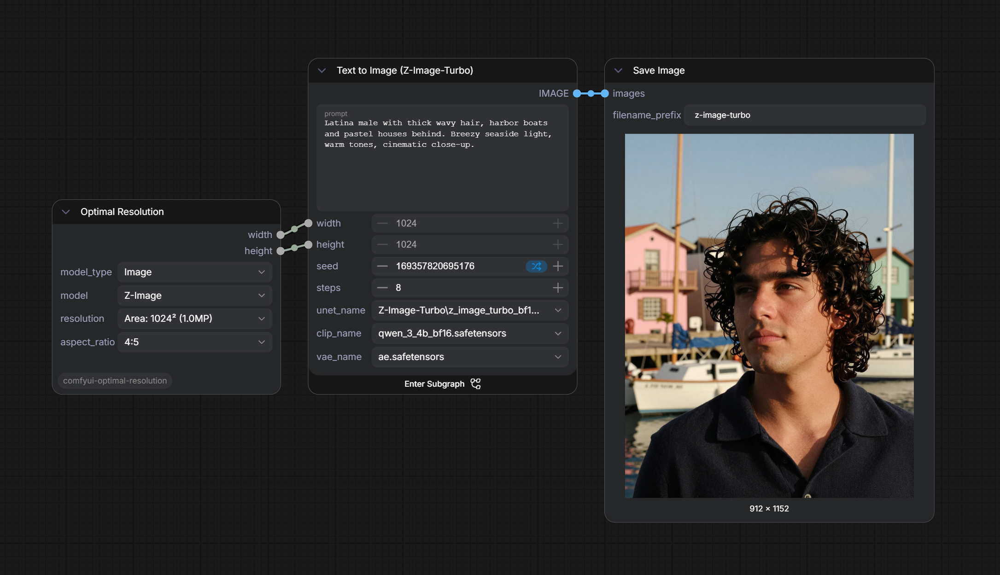

# ComfyUI Optimal Resolution

[](https://opensource.org/licenses/MIT)
[](https://github.com/comfyanonymous/ComfyUI)

<em>A custom node for <a href="https://github.com/comfyanonymous/ComfyUI">ComfyUI</a> that automatically computes the best width and height for any supported model, aspect ratio, and generation mode.</em>

---

## 🔍 Why This Node?

Different AI models (SDXL, FLUX, Qwen, Wan, …) have different “native” resolutions and constraints. Using the wrong size can degrade quality or even cause errors. **ComfyUI‑Optimal Resolution** takes the guesswork out of the equation:

* **Model‑aware** – each model has its own base resolution and divisor.
* **Mode‑aware** – supports *Area‑based*, *Fixed exact*, and *model‑specific modes* (e.g. 720p for Wan).
* **Dynamic UI** – dropdowns automatically filter valid aspect ratios and modes based on the selected model.
* **Instant feedback** – the calculated resolution is displayed directly on the node (for Nodes 1.0), so you always know what you’ll get.

---

## 🚀 Installation

### 1. Clone the repository
```bash
cd ComfyUI/custom_nodes
git clone https://github.com/caradat/comfyui-optimal-resolution.git
```

### 2. Restart ComfyUI
After restarting, you’ll find the **“Optimal Resolution”** node under the `image` category.

*That’s it – no additional Python packages are required.*

---

## 🧪 Usage



1. Add the **Optimal Resolution** node to your workflow.
2. Choose **Image** or **Video** model type.
3. Pick your model (e.g., *Z-Image Turbo*).
4. Select the desired **resolution mode** (e.g., *Area 1024² (1.0MP)*).
5. Choose an **aspect ratio** – only valid options for the current mode are shown.
6. The node outputs two integers: `width` and `height`, which you can feed directly into an **Empty Latent Image** or any other resolution‑dependent node.

---

## ⚙️ Configuration

All model data is stored in `models_data.json` at the root of the extension. You can extend or modify it without touching the Python/JavaScript code.

### Key sections of the JSON

| Key                | Description                                                                       |
|--------------------|-----------------------------------------------------------------------------------|
| `model_types`      | Groups models into “Image” and “Video” types.                                     |
| `resolutions`      | Named area‑based resolutions (e.g. `1024² (1.0MP)`).                              |
| `exact_resolutions`| Fixed width×height pairs for models that use exact sizing.                        |
| `aspect_ratios`    | Default list of aspect ratios; can be overridden per model/mode.                  |
| `models_data`      | Per‑model settings: `base_resolution`, `multiple_of`, `resolution_options`, etc.  |

*(Example: adding a new model is as simple as adding a new entry to `models_data`.)*

---

## 📦 Supported Models

| Type  | Model                 | Base Resolution | Divisor | Special Modes       |
|-------|-----------------------|-----------------|---------|---------------------|
| Image | Stable Diffusion 1.5  | 512             | 8       | Area: 0.26 MP       |
| Image | SDXL Base             | 1024            | 16      | Fixed (exact), Area |
| Image | Flux 1                | 1024            | 16      | Standard            |
| Image | Flux 2                | 2048            | 16      | Area (0.26‑4.19 MP) |
| Image | Qwen Image            | 1328            | 16      | Fixed (exact), Area |
| Image | Z‑Image               | 1024            | 16      | Standard            |
| Image | Ernie Image           | 1024            | 16      | Fixed (exact), Area |
| Video | Wan 2.2 14B           | 960             | 16      | 720p, 480p          |
| Video | Wan 2.2 5B            | 960             | 16      | 720p                |
| Video | SVD XT                | 768             | 16      | Standard            |
| Video | LTX 2.3               | 768             | 16      | Standard            |

*(All modes and exact resolutions are defined in the central `models_data.json` file.)*

---

## 🧠 How It Works (Architecture Overview)

The extension is split into two parts that communicate via ComfyUI’s internal API:

1. **Python backend** (`nodes.py`, `__init__.py`)
  * Loads `models_data.json`.
  * Exposes two API endpoints:
    * `GET /optimal_resolution/models` – serves the configuration to the frontend.
    * `POST /optimal_resolution/calculate` – receives parameters (model, mode, ratio) and returns the computed resolution.
  * Core logic (`calculate_resolution_logic`) handles exact resolutions, area‑based calculations, and divisor rounding.

2. **JavaScript frontend** (`js/optimal_resolution.js`)
  * Registers a ComfyUI extension that overrides `onNodeCreated`.
  * Fetches the model configuration and populates the dropdown widgets dynamically.
  * Listens to widget changes, debounces, and calls the `/calculate` API to update the display in real time.

This separation ensures the UI stays responsive while the heavy lifting (or future extensions) remains on the Python side.

---

## 📐 Resolution Calculation Logic

The node uses a multi‑step algorithm:

1. **Parse the aspect ratio** (e.g., `"16:9"` → ratio = 16/9).
2. **If “Fixed (exact)” mode** – look up the exact width/height for the chosen ratio in the model’s `exact_resolutions`.
3. **If an “Area” mode** – extract the area value from `resolutions` (e.g. 1.0 MP = 1 048 576 pixels), then derive height = √(area / ratio) and width = height × ratio.
4. **Round** both dimensions to the nearest multiple of the model’s divisor (usually 8 or 16).
5. **Enforce a minimum** equal to the divisor to prevent zero or negative sizes.

The display text is updated on the node automatically, so you never have to run a workflow just to see the numbers.

---

## 📁 Repository Structure

```
comfyui-optimal-resolution/
├── __init__.py           # Extension registration & API routes
├── nodes.py              # Main node class & resolution calculation
├── models_data.json      # Central configuration file
├── js/
│   └── optimal_resolution.js  # Frontend widget logic
├── LICENSE
└── README.md
```

---

## 📜 License

This project is licensed under the **MIT License**. See [LICENSE](LICENSE) for details.

---

Created by <a href="https://github.com/caradat">caradat</a>